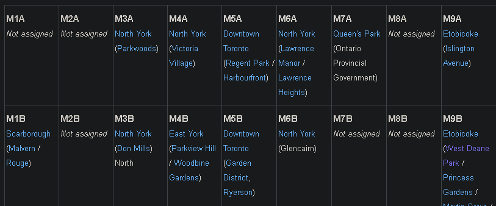
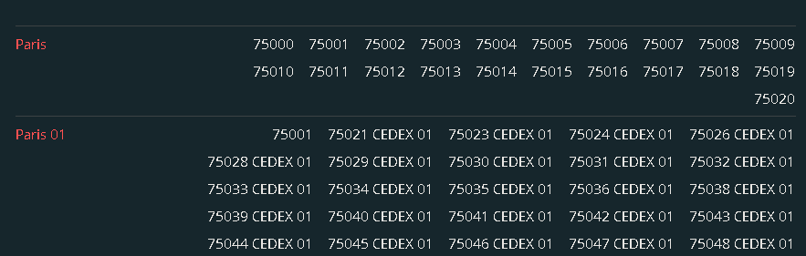
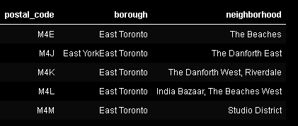
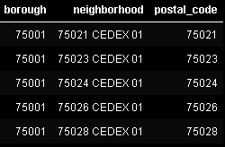
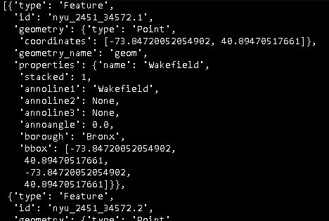
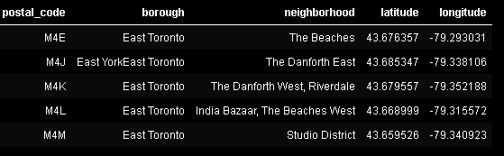
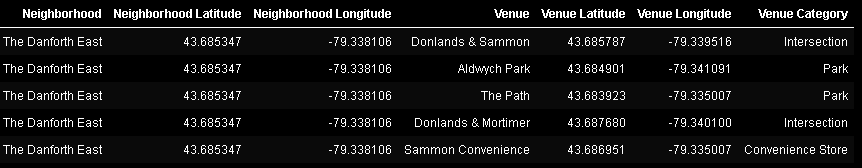
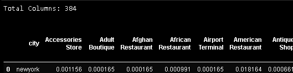
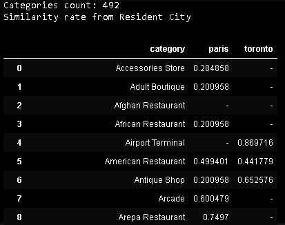

## Analysis of the degree of commercial distinction between cities

Report - Applied Data Science Capstone

### Introduction

Commonly, several people ask themselves which city they should travel to, where their preferred criterion of choice is how commercially different the city of travel is in relation to the places they have already visited or live.
The data analysis thar will be performed, seeks to prototype the resolution of this problem, comparing commercial profiles of two different cities (Toronto and Paris) to travel, for a resident of a specific city (new_york), evaluating the similarity level of existence and frequency of stores category in each travel cities in relation to the resident city.

Curious travelers will benefit from this analysis, as they will be able to sort their list of refined searches on which cities to visit, based on the statistical result of this degree of distinction.

This view on the level of distinction can contribute to better human experiences, considering that cities very different from their hometown, usually contribute to a more memorable travel experience.

### Methodology

#### Data acquisition and cleaning

To obtain data on commercial stores, the approach adopted was first to obtain the postal code data of the cities analyzed.

As a unified and standardized worldwide postal code base is not found, it was obtained from different websites, aiming at an already structured and reliable data source.
- For the city of Toronto, the source used was the online encyclopedia wiipedia (1), which contains all the postal codes of the country Canada.
- For the city of Paris, the source used was the worldpostalcode website, which demanded a greater treatment of the data. (2)
- For the city of New York, the source used was the website colcl.us. (3)

As the data for the 3 cities were not structured in the same way, it was necessary to do data engineering work to normalize them.

For the cities of Toronto and Paris, the data found was not structured in a two-dimensional table format, but with all the postal code data grouped in a single cell, where the cells were rearranged in a table without headings or labels.

Toronto:

Paris:

Thus, it was necessary to apply a data cleaning process, in order to structure them in a table with postal code, neighborhood and address, whose primary key was the postal code, consolidating names of addresses that perhaps belonged to the same postal code. A textual filter was also applied in the database of the country Canada, in order to filter only the data from the City of Toronto.
For this data modeling work, lib Pandas was used, which is specialized for this type of work.

Toronto:

Paris:

As for the city of New York, the data found were already properly structured in json format, and they already had data on postal code coordinates, which facilitated the data normalization process.

New York:

#### Data enrichment

From these postal codes, together with the Geopy geo-location lib (4), it was possible to obtain the coordinates of each postal code.

Toronto:

From these coordinates together with the FourSquare geo-location API, with support for searching for commercial data, a search for commercial establishments within a radius of 500 meters (5) was applied, thus enriching the database with names of establishments and their categories.

Toronto:

#### Data modeling

As the objective of the analysis is to evaluate the difference in the profiles of venues, the databases were subjected to a transformation so that all the observed commercial categories became columns in the database.

Having their values structured as a Boolean data table, so that a single line represented by a venue, was identified in a Boolean form by the column corresponding to its category, by grouping the data by City and applying the arithmetic mean function in Boolean columns of category, it was possible to calculate the proportion of the existence of different categories of commercial establishments in the city. Thus, the sum of all decimal values reached the expected "total" of 1 (100%).

To illustrate one of the cases, for the data of the residential city of New York, the database reached the mark of 384 columns of categories.

#### Data Analysis method

To calculate the degree of distinction of the venues profiles of the city, the function was taken:

**Variables:**

Being X, the proportion of existence of a commercial category in the residential city;

Y, the proportion of existence of a commercial category in a city for travel;

Z, the function of degree of distinction of 1 category between 2 cities;

W,  the function of the degree of distinction of the commercial categories of 2 cities.

**Function:**

x: Proportion of venue category in resident city

y: Proportion of venue category in destination city

z: `1-[min(x, y) / max(x, y)`

w: `mean(∑z)`

Note: if min(x, y) == 0, then z == 1

The function being the ratio between the proportion of each venue category existing in the two cities. In this way, if the proportions were identical, it would result in 1 and as your level of difference increases, it would approach 0.
Subsequently, subtracting its result from 1, converting the nature from similarity to distinction.

During the analysis of the proportion of some venue category between two cities, if any of them existed in one city, but did not exist in the other, the function would result in a mathematical indeterminacy, since it is not possible for the value Zero to be the numerator of a reason.
Thus, it was necessary to apply some approaches to maintain the model adherent to the intention of the analysis.
Considering that the lack of a venue category in a destination city, does not represent a gain in human experience due to the city's level of distinction, but the opposite case is expected to result in a more remarkable experience of the trip, the modeling of the function gained some peculiarities.

Special cases:
- In cases where the venue category exists in the resident city and does not exist in the destination city, the distinction function would not be awarded, the category being discarded from the analysis between the two cities.
- In cases where the commercial category does not exist in the resident city, but exist in the destination city, variable Z would be considered as 1. Maximum degree of distinction.

### Results

It was observed that from the resident city of New York, the city of Paris presents a greater degree of distinction (61%) in commercial establishments than the city of Toronto (54.6%).

Interestingly, it is worth mentioning that one of the factors of strong influence for this result, was the consideration of the special cases highlighted in the model. If the absence of any venue category in one of the cities represented a degree of maximum distinction for that category, without any caveat about the source of this non-existence, the city of Toronto would be 74.8% more distinct, compared to 67.8% to Paris.

### Discussion
During the modeling of the function, innumerable hypotheses were raised trying to keep the statistical result adherent to the empirical expectations from the point of view of a traveler.
Despite efforts, the discussion on model optimization is nowhere near exhausted.
Some improvement opportunities are worth mentioning to inspire future optimizations.
As an example, although the cases of mathematical indeterminations in the calculation of the ratio have been circumvented with the special cases, it was also observed that in different cases such as the one below, the degree of distinction of the category would not be changed, remaining at 100%.
Considering that a category that does not exist in the resident city:
A-In which case in the destination city, the commercial category has 0.01% of proportion.
B- In which case, in the destination city, the commercial category has a 0.10% proportion between the frequency level.
In the different cases described above, for a distinction analysis of the commercial profile, it is empirically observed that case B would be more attractive to the intention of the model, since a greater existence of a commercial category in the destination city would tend to increase the positive experience of a traveler who does not have this venue category in his hometown.
But the proposed function would return a degree of distinction as 100% for both cases, not reporting a difference in their degree of distinction.

### Conclusion
In this study it was observed statistically, that from a commercial perspective, the city of Paris / France represents a more attractive destination for a resident of the city of New York with a degree of distinction of 61%, as opposed to a trip to the city of Toronto / Canada, which reached a degree of distinction of 54.6%.
Despite the diversity of destination cities under analysis for decision making having been only two, the model is not restricted by the number of cities and can be used to guide decisions in scenarios with greater options.

### References
1- The toronto city data source: https://en.wikipedia.org/wiki/List_of_postal_codes_of_Canada:_M

2- The new_york city data source: https://cocl.us/new_york_dataset

3- The Paris city data source: https://worldpostalcode.com/france/ile-de-france/paris

4- Geopy python lib: https://geopy.readthedocs.io/en/stable/#nominatim

5- API foursquare, venue seach method: https://developer.foursquare.com/docs/api-reference/venues/search/
